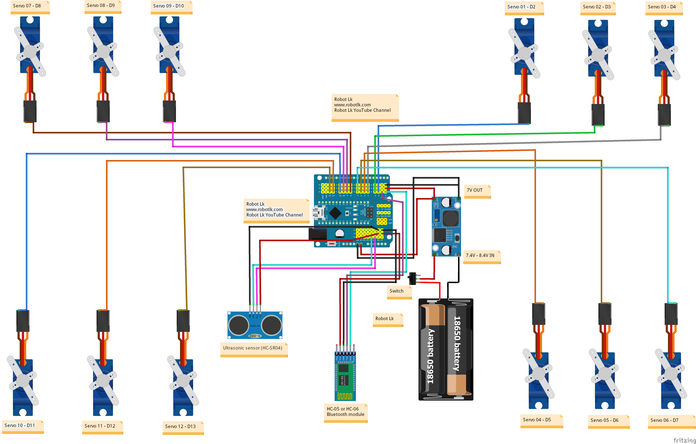

# 🕷️ Spider Robot

A 4-legged, 12-servo spider robot built on Arduino with two operating modes: **Bluetooth remote control** and **autonomous obstacle avoidance**. Features inverse kinematics for smooth, natural movement and an OLED display for expressive "face" animations (Bluetooth mode).

---

## 📸 Circuit Diagram



---

## ✨ Features

- 4 legs × 3 DOF each = **12 servos** with full 3D inverse kinematics
- **Bluetooth mode** — control via any serial Bluetooth app (HC-05 / HC-06)
- **Obstacle avoidance mode** — autonomous navigation using an HC-SR04 ultrasonic sensor
- **OLED face expressions** — happy, sad, angry, sleepy animations on a 128×32 SSD1306 display (Bluetooth mode)
- Movement routines: walk forward/back, turn left/right, hand wave, hand shake, body dance
- Powered by dual **18650 Li-ion cells** stepped down to 7 V for the servos

---

## 🛒 Hardware

| Component | Qty | Notes |
|---|---|---|
| Arduino Nano (or Uno) | 1 | Main microcontroller |
| SG90 / MG90 Servo | 12 | 3 per leg |
| HC-SR04 Ultrasonic Sensor | 1 | Obstacle avoidance |
| HC-05 or HC-06 Bluetooth Module | 1 | Remote control |
| SSD1306 OLED Display (128×32) | 1 | Face animations (BT mode) |
| DC-DC Buck Converter | 1 | Steps 7.4–8.4 V → 7 V |
| 18650 Li-ion Battery × 2 | 1 set | ~7.4 V supply |
| Toggle Switch | 1 | Power on/off |

---

## 🔌 Wiring

### Servo Pin Mapping

| Leg | Servo | Arduino Pin |
|---|---|---|
| Leg 0 (front-right) | Coxa / Femur / Tibia | D3 / D4 / D2 |
| Leg 1 (front-left) | Coxa / Femur / Tibia | D6 / D7 / D5 |
| Leg 2 (rear-right) | Coxa / Femur / Tibia | D9 / D8 / D10 |
| Leg 3 (rear-left) | Coxa / Femur / Tibia | D12 / D11 / D13 |

Servo labels in the diagram correspond to: **Servo 01–03** (D2–D4), **04–06** (D5–D7), **07–09** (D8–D10), **10–12** (D11–D13).

### Sensors & Peripherals

| Module | Pin(s) |
|---|---|
| HC-SR04 — Trigger | A5 (D19) |
| HC-SR04 — Echo | A4 (D18) |
| Bluetooth TX/RX | D0 / D1 (hardware serial) |
| OLED SDA / SCL | A4 / A5 (I²C) |

> **Note:** The OLED and Bluetooth module share the same Arduino and are used in separate firmware sketches — do not flash both simultaneously.

### Power

- Two 18650 cells in series (~7.4 V) → DC-DC buck converter → **7 V rail** for all servos
- Arduino powered from the same rail via VIN or USB during programming

---

## 💾 Firmware

Two independent sketches are provided:

| File | Mode |
|---|---|
| `Bluetooth-controlling_spider_robot.ino` | Bluetooth remote control + OLED face |
| `Obstacle_Avoiding_Spider_Robot.ino` | Autonomous obstacle avoidance |

### Required Libraries

Install via **Arduino Library Manager** (`Sketch → Include Library → Manage Libraries`):

| Library | Purpose |
|---|---|
| `Servo` (built-in) | Servo control |
| `FlexiTimer2` | 50 Hz servo ISR timing |
| `NewPing` | HC-SR04 ultrasonic driver |
| `Adafruit SSD1306` | OLED display driver |
| `Adafruit GFX Library` | OLED graphics primitives |
| `Wire` (built-in) | I²C communication |

---

## 🚀 Getting Started

1. **Assemble** the robot frame and mount all 12 servos.
2. **Wire** components as per the circuit diagram above.
3. **Install** all required libraries in the Arduino IDE.
4. **Choose a sketch** depending on the desired mode.
5. **Upload** to your Arduino Nano via USB.
6. **Power on** via the toggle switch.

On first boot the robot will stand up and perform a short greeting animation before awaiting commands.

---

## 🎮 Bluetooth Commands

Connect with any Bluetooth serial terminal app (e.g. **Serial Bluetooth Terminal** on Android) at **9600 baud**. Send single characters:

| Command | Action | OLED Expression |
|---|---|---|
| `F` | Step forward | 😊 Happy |
| `B` | Step backward | 😢 Sad |
| `L` | Turn left | 😠 Angry (variant 2) |
| `R` | Turn right | 😠 Angry (variant 1) |
| `W` | Hand wave | — |
| `U` | Hand shake | — |
| `V` | Body dance | — |

---

## 🤖 Obstacle Avoidance

When flashed with the obstacle avoidance sketch, the robot:

1. Walks forward continuously.
2. Continuously polls the HC-SR04 sensor.
3. When an obstacle is detected within **20 cm**, it stops, turns in a random direction, and resumes walking.

The detection threshold can be adjusted by changing `int thresh = 20;` (value in cm) at the top of the sketch.

---

## ⚙️ Kinematics Parameters

The robot uses 3-DOF inverse kinematics per leg. Key physical dimensions (in mm):

| Parameter | Value |
|---|---|
| Coxa length (`length_c`) | 27.5 |
| Femur length (`length_a`) | 50 (BT) / 55 (obstacle) |
| Tibia length (`length_b`) | 77.1 (BT) / 77.5 (obstacle) |
| Body side length | 71 |
| Default stance Z | −50 |
| Step height Z | −30 |

---

## 📁 File Structure

```
.
├── Bluetooth-controlling_spider_robot.ino   # Bluetooth + OLED sketch
├── Obstacle_Avoiding_Spider_Robot.ino        # Autonomous mode sketch
└── spider-3-in-1_bb.png                      # Fritzing circuit diagram
```
